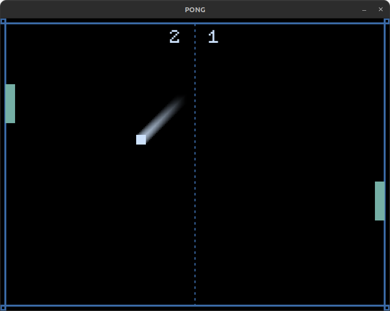

# Pong game

**Project type:** PC video game.  
**Brief description:** Pong has been made with LÖVE (also known as Love2D), a Lua framework. This is a cross-platform PC game (Windows, Mac and Linux) for two local players.  
**Technologies:** LÖVE (Lua).  

To launch it from the clone, [install LÖVE](https://love2d.org/#download) and then type ``love directory_name``.

Or you can download it already compiled:
- [Windows 64-bit](https://drive.google.com/file/d/1aLPK43SrrZ6pjd4u1a6FRDEK4knDlCj2/view?usp=sharing)
- [Windows 32-bit](https://drive.google.com/file/d/1dvCUwX63VWc4xC4dJyKX7R8ncvzy-Tnr/view?usp=sharing)
- [Mac](https://drive.google.com/file/d/1th1lx6F7s0woTE8Ms8rjjjgk8olOx4Pr/view?usp=sharing)
- [Linux](https://drive.google.com/file/d/1FZ0SUoecl0avoehFgFWQjeFwjhGUTNFK/view?usp=sharing)
